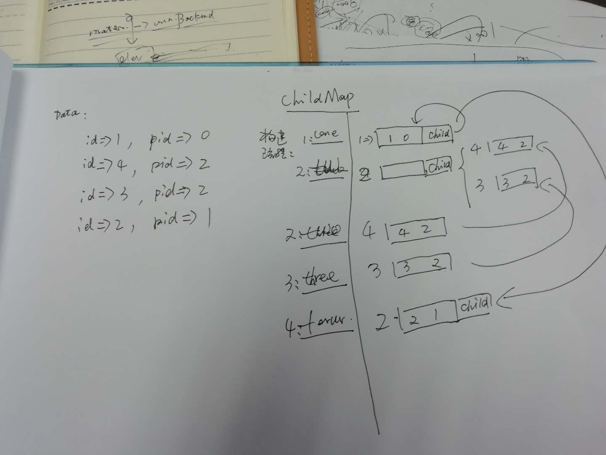

# 概述

从二维数据源构建树型结构

## 安装
```
composer require scalpel/tree
```

# 概念

## Tree

树对象, 主要职责生成节点对象

```
function getElementById($id);
function getRoot();
function getParent($id)
function getParnets($id)
function getChild($id, $maxLevel = 1)
function getChildIdentifying($self = false);
```

### DbTree

依赖db\table对象提交数据源

### Tree 

二维数组数据源

### BTree
通过地址引用, 实现树结构

二维数组数据源

## Node

节点对象, 主要职责获取节点属性, 获取上下级关联节点

* 获取显示名称
* 获取节点属性
* 获取子节点
* 获取父节点

```

/**
 * Interface NodeInterface
 * @package jcom\tree
 */
interface NodeInterface extends \ArrayAccess {
    # 父节点关系
    # ----------
    function getParent($isTop = false);
    function getParents($self = false);
    function hasParent();

    # 子节点关系
    # ----------
        
    function getChild();
    function hasChild();
    function isContain(NodeInterface $node);
    function getChildIdentifying($self = false);

    function getDeep();

    # 节点属性
    # ----------
    
    function getProp($key, $def = null);
    function setProp($key, $value = null);
    function getId();
    function getName($full = false, $separator = ' > ');
    function __toString();

}
```

## 性能

执行同样数量类别统计树构建, 测试代码@see tests/TreeTest3.php

1. Tree 0.05126
1. BTree 0.04886
2. DBTree 0.82187


## 使用

设计有三种方式实现了树构建

```php

use j\db\Table;
use j\tree\BTree;
use j\tree\DbTree;
use j\tree\Tree;
use j\tree\TreeInterface;

$data = array(
    array('pid' => 0, 'name' => 'name 1', 'id' => 1),
    array('pid' => 0, 'name' => 'name 2', 'id' => 2),
    array('pid' => 0, 'name' => 'name 9', 'id' => 9),

    array('pid' => 2, 'name' => 'name 3', 'id' => 3),
    array('pid' => 2, 'name' => 'name 4', 'id' => 4),
    array('pid' => 2, 'name' => 'name 5', 'id' => 5),

    array('pid' => 1, 'name' => 'name 6', 'id' => 6),
    array('pid' => 1, 'name' => 'name 7', 'id' => 7),

    array('pid' => 6, 'name' => 'name 8', 'id' => 8),
    array('pid' => 6, 'name' => 'name 10', 'id' => 10)
);

$tree = Tree::getInstance();
$tree->setSource($data);
__testTree($tree);

$tree = BTree::getInstance();
$tree->setSource($data);
__testTree($tree);

$tree = DbTree::getInstance();
$tree->setSource(Table::factory('test.category'));
__testTree($tree);


/**
 * @param TreeInterface $tree
 */
function __testTree($tree){
    echo "Test " . get_class($tree);
    echo "\n\n";
    $node = $tree->getRoot();
    assert_expr(count($node->getChild()) == 3, 'test root');
    assert_expr(count($tree->getElementById(1)->getChild()) == 2, 'test getChild');
    assert_eq(count($tree->getElementById(1)->getChild()), 2, 'test getChild');

    assert_eq(count($tree->getElementById(1)->getChildIdentifying()), 4, 'test getChildIdentifying');
    assert_eq(count($tree->getElementById(6)->getChildIdentifying()), 2, 'test getChildIdentifying');

    assert_expr($tree->getElementById(1)->hasChild(), 'test hasChild');
    assert_expr($tree->getElementById(2)->hasChild(), 'test hasChild');
    assert_expr($tree->getElementById(6)->hasChild(), 'test hasChild');
    assert_expr(!$tree->getElementById(3)->hasChild(), 'test hasChild');
    assert_expr(!$tree->getElementById(8)->hasChild(), 'test hasChild');
    assert_expr(!$tree->getElementById(10)->hasChild(), 'test hasChild');

    assert_eq($tree->getElementById(8)->getParent(true)->getId(), 1, 'test getParent 1');
    assert_eq($tree->getElementById(10)->getParent(true)->getId(), 1, 'test getParent 1');
    assert_eq($tree->getElementById(6)->getParent(true)->getId(), 1, 'test getParent 2');
    assert_eq($tree->getElementById(8)->getParent()->getId(), 6, 'test getParent 3');
    assert_eq($tree->getElementById(6)->getParent()->getId(), 1, 'test getParent 4');
    assert_eq($tree->getElementById(1)->getParent(), null, 'test getParent 5');

    assert_eq(count($tree->getElementById(1)->getParents()), 0, 'test getParents 1');
    assert_eq(count($tree->getElementById(6)->getParents()), 1, 'test getParents 2');
    assert_eq(count($tree->getElementById(8)->getParents()), 2, 'test getParents 3');

    assert_expr(!$tree->getElementById(1)->hasParent(), 'test hasParent');
    assert_expr(!$tree->getElementById(2)->hasParent(), 'test hasParent');
    assert_expr($tree->getElementById(3)->hasParent(), 'test hasParent');
    assert_expr($tree->getElementById(6)->hasParent(), 'test hasParent');
    assert_expr($tree->getElementById(8)->hasParent(), 'test hasParent');

    assert_eq($tree->getElementById(2)->getDeep(), 0, 'test getDeep');
    assert_eq($tree->getElementById(6)->getDeep(), 1, 'test getDeep');
    assert_eq($tree->getElementById(8)->getDeep(), 2, 'test getDeep');

    echo "Test foreach\n";
    foreach($tree->getElementById(0) as $node){
        assert_expr(in_array($node->getId(), [1, 2, 9]), 'test foreach');
        assert_expr(in_array($node['id'], [1, 2, 9]), 'test foreach');
    }

    foreach($tree->getElementById(2) as $node){
        assert_expr(in_array($node->getId(), [3, 4, 5]), 'test foreach');
    }

    foreach($tree->getElementById(6) as $node){
        assert_expr(in_array($node->getId(), [8, 10]), 'test foreach');
    }

    echo "test over\n\n";
}

```


## Tests

```
cd tests
phpunit.phar ./
```
